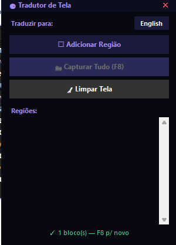
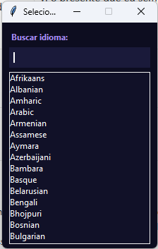
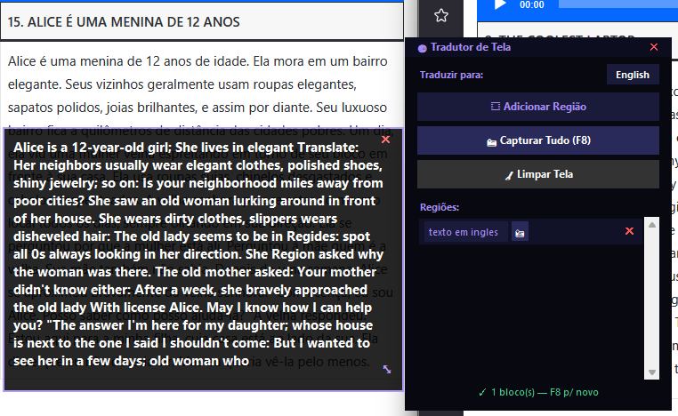
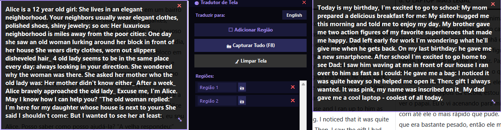

# 🌐 Tradutor OCR

Ferramenta desktop para capturar texto de qualquer parte da tela e traduzir instantaneamente para o idioma que você quiser. Funciona em qualquer programa — jogos, PDFs, vídeos, imagens, sites que o Google Translate não consegue traduzir.

---

## ✨ Funcionalidades

- **Captura por atalho** — pressione `F8` de qualquer lugar do PC e selecione a área com o mouse
- **Suporte a imagens** — abra arquivos de imagem diretamente pelo programa
- **Múltiplos idiomas** — traduza para Português, Inglês, Espanhol, Francês, Japonês, Alemão, Italiano e Chinês
- **Detecção automática** — identifica o idioma de origem automaticamente
- **Copiar com um clique** — botão para copiar a tradução para a área de transferência
- **Interface escura** — tema dark com visual moderno

---

## 🖥️ Como usar

1. Execute o `TradutorOCR.exe`
2. Escolha o idioma de destino no dropdown
3. Pressione `F8` em qualquer momento
4. Clique e arraste para selecionar a área com o texto
5. A tradução aparece automaticamente

Ou clique em **"Abrir imagem"** para traduzir um arquivo de imagem direto do seu PC.

---
## 📸 Screenshots

**Janela principal**


**Resultado da tradução**


**Seletor de linguagem**


**Traduzindo texto em inglês**


**Textos simultâneos**



## 🚀 Instalação para desenvolvimento

### 1. Requisitos

- Python 3.10+
- Tesseract OCR instalado separadamente

### 2. Instale o Tesseract

Baixe o instalador para Windows:
👉 https://github.com/UB-Mannheim/tesseract/wiki

Durante a instalação:
- Marque **"Add to PATH"**
- Em idiomas adicionais, marque **"Portuguese"**

### 3. Clone o repositório

```bash
git clone https://github.com/RodrigoRuan2/tradutor-ocr.git
cd tradutor-ocr
```

### 4. Instale as dependências

```bash
pip install -r requirements.txt
```

### 5. Execute

```bash
python main.py
```

---

## 📦 Gerar o .exe

```bash
python build.py
```

O executável será gerado em `dist/TradutorOCR.exe`.

> **Atenção:** O Tesseract precisa estar instalado no PC onde o `.exe` for rodar.

---

## 🗂️ Estrutura do projeto

```
tradutor-ocr/
│
├── main.py          
├── controle.py      
├── captura.py / seletor.py      
├── traducao.py      
├── overlay.py       
│
├── requirements.txt 
└── README.md
```

---

## 🛠️ Tecnologias

| Biblioteca | Função |
|---|---|
| `customtkinter` | Interface gráfica moderna com tema escuro |
| `pytesseract` | Conector Python para o Tesseract OCR |
| `Pillow` | Manipulação de imagens e screenshots |
| `deep_translator` | Tradução via Google Translate sem API key |
| `keyboard` | Captura de atalhos globais de teclado |
| `pyperclip` | Copiar texto para a área de transferência |

---

## ⚠️ Solução de problemas

**"Tesseract não encontrado"**
Edite `ocr.py` e descomente a linha com o caminho manual:
```python
pytesseract.pytesseract.tesseract_cmd = r"C:\Program Files\Tesseract-OCR\tesseract.exe"
```

**O .exe abre e fecha na hora**
Abra o terminal na pasta `dist/` e rode `.\TradutorOCR.exe` para ver o erro.

**OCR não reconhece bem o texto**
Tente selecionar uma área maior. Textos com fontes decorativas ou muito pequenas têm menos precisão.

---

## 📝 Licença

MIT — use, modifique e distribua à vontade.
